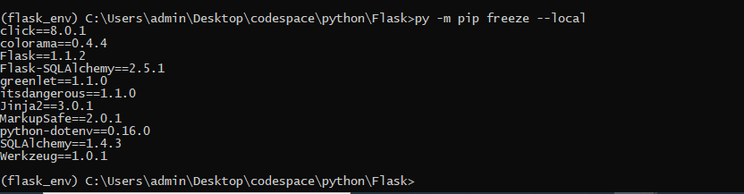

### Create Environment 
* ```python -m venv --system-site-packages --symlinks --clear --without-pip --prompt <promt> .env```

### Activate Environment
* For Windows  ```.env/Scripts/activate.bat```
* For Linux  ```source .env/bin/activate```

### Check Environment Creation
* For Windows ```where python```, should return new python path 
* For Linux ```which python3```  should return new python path


### Package Installation 
* For Windows ```python -m pip install -r requirements.txt``` or ```py -m pip install <package name> ```
* For Linux ```python3 -m pip install -r requirements.txt``` or ```python3 -m pip install <package name> ``` 

### List down Installed Packages
* For Windows ```python -m pip freeze --local``` .
* For Linux ```python -m pip freeze --local``` or ```python3 -m pip install <package name>
  

for details kindly visit [venv Package](https://packaging.python.org/guides/installing-using-pip-and-virtual-environments/)